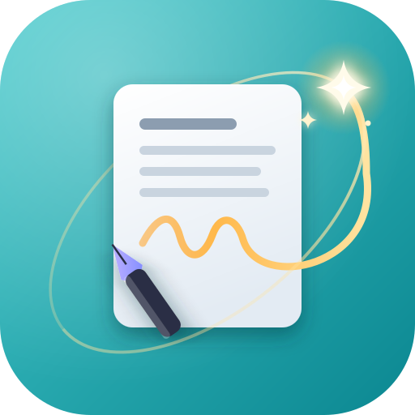

<h1 align="center">NoteTrace</h1>

<p align="center"><b>Trace Every Thought</b></p>

<p align="center">A self-hosted notes app: quick to capture, easy to find.<br/>
No accounts, no telemetry, no cloud sync unless you opt in.</p>

<p align="center">
  
</p>

<p align="center">
  <a href="LICENSE"></a>
  <a href="https://github.com/traceapps/notetrace/releases/latest"></a>
  <a href="https://github.com/traceapps/notetrace/pkgs/container/notetrace"></a>
  <a href="https://hub.docker.com/r/traceapps/notetrace"></a>
</p>

<p align="center">
  <b>iOS fund:</b> the Trace apps have no iOS app yet, because building one needs a Mac and an iPhone.
  <a href="https://traceapps.github.io/docs/support/">See the goal</a> or <a href="https://ko-fi.com/traceapps">chip in</a>. Self-hosting stays free either way.
</p>

---

**Jump to:** [What it is](#what-notetrace-is) · [Status](#status) · [Install](#install) · [Env vars](#env-vars)

---

## What NoteTrace is

NoteTrace is a self-hosted alternative to Google Keep. Open it and start typing: notes, checklists, and reminders in a clean card grid, with the polish and a few of the advanced features that simple note apps leave out.

It runs as a single Docker container on your own hardware, with a PWA for the browser and a native Android app for your phone. Fourth app in the Trace family alongside [NutriTrace](https://github.com/traceapps/nutritrace), [LiftTrace](https://github.com/traceapps/lifttrace), and [CookTrace](https://github.com/traceapps/cooktrace).

## Principles

- **Self-hosting is and will remain free.** The server, PWA, and source code will never be paywalled.
- **No trackers, no analytics, no telemetry.** NoteTrace doesn't phone home; your usage is invisible to anyone but you.
- **Your data stays on your hardware.** No central server, no cloud sync that can read it; nothing leaves your network unless you opt into a third-party integration (an AI provider, a push service).
- **Open source under AGPL-3.0.** Every line that touches your data is readable.

---

## Status

NoteTrace is feature complete and in testing toward v1.0.0. Working today:

- **Notes and checklists.** Card grid with a pinned section and quick capture, checklists with drag to reorder, images on any note, labels with colors and icons, sixteen note colors, archive, trash with a 30-day purge, full-text search (Ctrl+K), and version history.
- **A real editor.** Markdown underneath, with bold, italic, underline, highlight, links, headings, quotes, code, lists that indent, and checkboxes inside a text note. Select text and a small bar offers the common ones; slash commands and keyboard shortcuts cover the rest. Undo for deleted items and attachments.
- **Templates and printing.** Save a note as a template and start new notes from it. Print a note or save it as a PDF, from the browser or the Android app.
- **Reminders.** One-off or repeating (daily, weekly, monthly, yearly), kept at the same local time across daylight saving. Android fires them as exact alarms even with the app closed, the browser shows them while NoteTrace is open, and the server delivers them through your push service and a `reminder.fired` webhook.
- **Sharing.** Share a note or list with other accounts on your server, with view or edit access. Pin, archive, labels, and reminders stay personal.
- **Import and export.** Google Keep (Google Takeout, images included), Evernote (.enex), Memos (straight from your Memos server), Blinko backups, and Markdown files (Obsidian, Joplin, and other Markdown exports). Export everything as a Markdown ZIP with images.
- **Links and timeline.** `[[Note title]]` links with suggestions as you type and a Linked From section on the linked note; renaming a note updates the links. Switch the grid to a timeline grouped by day.
- **Voice notes.** Start one from Capture a thought, the + button, a home screen shortcut, or `v`. Pause while recording, with a level meter; the Android app keeps recording with the screen off, for up to 3 hours. Scrub the waveform, change the play speed, and pick up where you left off. Audio files, shared recordings, and Google Keep's voice recordings come in too (converted by the server's built-in ffmpeg when needed). Trace transcribes each one with timestamps you can tap, splitting long recordings to fit the provider.
- **Image text.** Trace reads the text in images, so a photo of a receipt or a whiteboard turns up in search.
- **Trace in your notes.** Tidy Up, Summarize, and Make a Checklist from the editor, and a Trace chat that can find, create, and update notes, check items off, and set reminders. The same note tools are on the MCP endpoint for external AI agents.
- **Tasks and List layout.** A Tasks view of checklist items with due dates and of checklists you choose to show there, grouped by due date or list, with a daily Tasks Due notification. A List layout with grouping by label, color, or date that opens the note beside the list on wide screens.
- **Fast with thousands of notes.** Notes draw a screenful at a time as you scroll; search, Select All, and the keyboard still cover the whole library.
- **Offline in the browser.** The installed web app opens without a connection, shows the notes, images, and voice notes it has seen, and lets you write. Edits, new notes, ticks, colors, labels, and reminders wait in an outbox and go up when you're back, merged the same way the phone's changes are. Open tabs stay in step, and a voice note whose upload fails waits on the device and goes up later.
- **Organize fast.** Filter search by type, color, and label; search marks the matching words and shows when a match came from a voice note or an image; select many notes and pin, color, label, remind, archive, or trash them at once; drag notes into your own order; nest labels (`Home/Garage`) and list them A to Z, by most used, or in an order you drag; a Shared with Me view; and link previews on cards, fetched by your server.
- **Foldables and screen sizes.** Navigation that fits the screen, a layout remembered per screen, the open note moving between full screen and the side pane as you fold and unfold, and layouts that keep content off the crease when a foldable is half open.
- **Polish.** A sidebar that collapses to icons, keyboard shortcuts (press `?`), slash commands in the editor, compact cards, swipe to archive and pull to refresh on phones, and a note that grows out of its card when opened.
- **CookTrace shopping list.** Your CookTrace list, live, in a Shopping List view grouped by aisle: check items off, add to it, and clear what's bought, offline too. Send a checklist's open items to it. The same item from two recipes shows once, with the amounts added up.
- **Share from anywhere.** Share text, links, photos, and audio into a new note from any Android app or into the installed web app, and an optional fingerprint, face, or PIN app lock on Android.
- **Home screen widgets.** A quick note bar with buttons for a list, a voice note, and a drawing, a scrolling list of your notes that opens the one you tap, and a New Note tile in the quick settings.
- **Drawings and files.** Draw on any note, and attach files of any kind alongside images and recordings.

The foundation it shares with the other Trace apps:

- **Accounts.** Multi-user with OIDC SSO (Authentik, Keycloak, Pocket ID, Authelia, and others).
- **Backups.** Full-database zip, scheduled auto-backups, portable export, Android local-backup zip.
- **Android app.** Offline local mode or server-connected differential sync.
- **In-app updates.** Stable and Dev channels, same as the rest of the family.
- **Trace AI.** Multi-provider assistant (Claude / OpenAI / Gemini / any OpenAI-compatible endpoint).
- **Push notifications.** Apprise, Gotify, and ntfy.
- **Integrations.** API tokens, webhooks, and an MCP endpoint.
- **Accessibility.** Dialogs hold and return focus, switches say what they are, landmarks and headings are in place, and text meets contrast targets, checked with an automated audit.

What comes next, including the Wear OS companion, is in [ROADMAP.md](ROADMAP.md).

---

## Apps

- **Web (PWA).** Any modern browser. Add to home screen for a full-screen app-like experience.
- **Android.** Signed APK on the [Releases page](https://github.com/traceapps/notetrace/releases/latest). Local mode is fully offline; connected mode syncs to your server.
- **Wear OS.** Planned companion app for checklists, voice notes, and reminders.
- **iOS.** Not currently available.

---

## Install

Published to two registries with identical tag sets: `ghcr.io/traceapps/notetrace` (primary) and `traceapps/notetrace` on [Docker Hub](https://hub.docker.com/r/traceapps/notetrace) (mirror).

Minimal `docker-compose.yml`:

```yaml
services:
  notetrace:
    image: ghcr.io/traceapps/notetrace:latest
    container_name: notetrace
    ports:
      - "3004:3004"
    volumes:
      - ./data/db:/data/db
      - ./data/uploads:/data/uploads
    environment:
      - JWT_SECRET=change-me-to-a-long-random-string
      - DB_PATH=/data/db/notetrace.db
      - UPLOADS_PATH=/data/uploads
    restart: unless-stopped
```

Generate the JWT secret with `openssl rand -base64 48`, then:

```bash
docker compose up -d
```

Open `http://localhost:3004` and a first-run wizard walks you through creating an admin account. See [DEPLOY.md](DEPLOY.md) for the full walkthrough.

---

## Env vars

| Variable | Default | Purpose |
|---|---|---|
| `JWT_SECRET` | - | Signing key for auth tokens. Required when user management is on. |
| `DB_PATH` | `/data/db/notetrace.db` | SQLite file inside the container. |
| `UPLOADS_PATH` | `/data/uploads` | Uploaded images and server-side backups. |
| `PORT` | `3004` | Port the server listens on inside the container. |
| `BASE_URL` | - | Mount at a subpath, e.g. `/notetrace`. |
| `LOG_LEVEL` | `info` | `error` \| `warn` \| `info` \| `debug`. |
| `INSECURE_COOKIES` | unset | Set to `1` on plain-HTTP LAN deployments so the auth cookie isn't dropped. |
| `MAX_SESSION_HOURS` | `8760` | Session-length cap in hours. Lower for shared / kiosk machines. |
| `BACKUP_UPLOAD_MAX_MB` | `512` | Upload cap for restore-from-zip. |
| `BACKUP_SCHEDULE` | - | `off` \| `daily` \| `weekly` \| `monthly`. Locks the UI field when set. |
| `BACKUP_TIME` | - | Auto-backup time (HH:MM, container TZ). Locks the UI field. |
| `BACKUP_RETENTION` | - | How many auto-backups to keep. |
| `SMTP_HOST` / `SMTP_PORT` / `SMTP_USER` / `SMTP_PASS` / `SMTP_FROM` / `SMTP_SECURE` | - | Password reset + invite email. Without SMTP, invites fall back to a copyable link. |
| `AI_PROVIDER` / `AI_API_KEY` / `AI_MODEL` / `AI_BASE_URL` / `AI_ENABLED` | - | Lock Trace to a server-side provider. |
| `AI_TRANSCRIBE_MODEL` | provider default | Speech-to-text model for voice notes when Trace is set by env (`gpt-4o-mini-transcribe` on OpenAI, `whisper-1` on OpenAI-compatible servers). |
| `OIDC_ISSUER` / `OIDC_CLIENT_ID` / `OIDC_CLIENT_SECRET` (or numbered `OIDC_PROVIDER_N_*`) | - | OIDC SSO provider(s). Env-defined providers are read-only in the UI. |
| `MCP_ENABLED` / `MCP_WRITE_ENABLED` / `MCP_DESTROY_ENABLED` | unset | Model Context Protocol endpoint and its write / destructive tiers. |
| `WEBHOOKS_ENABLED` | unset | Outgoing signed webhooks. |
| `ALLOW_PRIVATE_COOKTRACE_URLS` | unset | Allow Send to CookTrace to reach a CookTrace on a LAN or Docker network address. |
| `ALLOW_PRIVATE_LINK_PREVIEWS` | unset | Show link previews for links to LAN, loopback, or Docker network addresses. |
| `FFMPEG_PATH` / `FFPROBE_PATH` | `ffmpeg` / `ffprobe` | Audio tools for converting voice recordings and splitting long ones for transcription. The Docker image includes a small audio-only build; set these when running outside Docker. |

Env values take priority over Settings-UI values and lock the field for all users. The full annotated list is in [.env.example](.env.example).

---

## Data persistence

Bind-mount two host directories: the SQLite database (`DB_PATH` dir) and uploads (`UPLOADS_PATH`, which also holds `uploads/backups/`). The container is stateless beyond these two volumes.

## Updating

```bash
docker compose pull
docker compose up -d
```

Schema migrates on startup. Images are multi-arch (linux/amd64 + linux/arm64).

---

## Tech stack

Svelte 5 (compat mode) + Vite 7 PWA · Capacitor 8 Android · Node.js + Express 5 + better-sqlite3 · JWT httpOnly cookies + OIDC 1.0 (PKCE + state + nonce) · multi-arch Docker via GitHub Actions → GHCR + Docker Hub.

---

## Trace family

Part of the **TraceApps** family. Sister apps: [NutriTrace](https://github.com/traceapps/nutritrace) for nutrition tracking, [LiftTrace](https://github.com/traceapps/lifttrace) for weightlifting, [CookTrace](https://github.com/traceapps/cooktrace) for recipes and cooking. Docs for the family at [traceapps.github.io/docs](https://traceapps.github.io/docs/).

---

## More

[ROADMAP.md](ROADMAP.md) · [CONTRIBUTING.md](CONTRIBUTING.md) · [PRIVACY.md](PRIVACY.md)

## Support

NoteTrace is free to self-host and always will be. No paid tier, nothing behind a donation, no telemetry. It's built and maintained by one person.

**The current goal is iOS.** None of the Trace apps run properly on an iPhone, because building and testing for iOS needs Apple hardware: a Mac mini ($600), a used iPhone 15 ($500), the Apple Developer Program ($99 a year), and a Google Play developer account ($25, so the Android apps can go on Play too). With tax and payment fees that's about $1,300, and the full breakdown is on the [Support page](https://traceapps.github.io/docs/support/).

Helping doesn't have to cost anything: starring the repo, reporting bugs with detail, and translating all count, and stars are how self-hosted projects get found.

[](https://ko-fi.com/traceapps)

## License

[AGPL-3.0](LICENSE): entire codebase including the Android app source.
